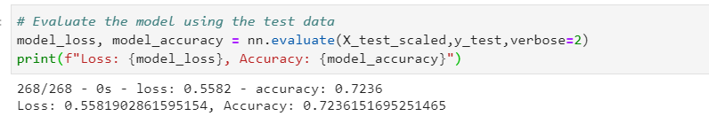

# Neural_Network_Charity_Analysis

## Overview

With knowledge of machine learning and neural networks, we will be using the features in the provided dataset to help Beks create abinary classifier that is capable of predicting whether applicants will be succesful if funded by Alphabet Soup.

## Results

- Data Preprocessing
  - What variable(s) are considered the target(s) for your model?
    - The column "IS_SUCCESSFUL" will be our traget.
  - What variable(s) are considered to be the features for your model?
    - All of the columns except for "EIN" and "NAME" are  considered to be features for our model.
   - What variable(s) are neither targets nor features, and should be removed from the input data?
    - as previously stated "EIN" and "NAME" have no impact on our model.
    
    
- Compiling, Training and Evaluating the Model
  - How many neurons, layers, and activation functions did you select for your neural network model?
    - 3 Hidden layers
    - For the firt layer I used 2 times the number of features(recommended)
    - The second layer I used 3 times the number of features.
    - The third layer is used 3 times the number of features.
    - For all 3 layers i used the same activation "relu".
    - The output layer i used "sigmoid".
  - Were you able to achieve the target model performance?
     - No, as seen in the pciture below i only got 72.36% accuracy score.
     
  
    
